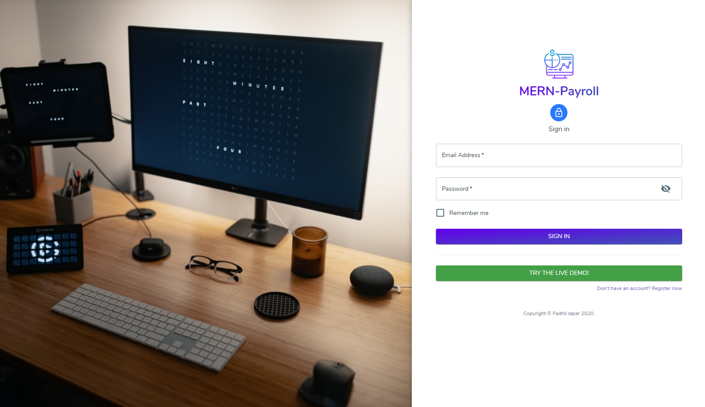
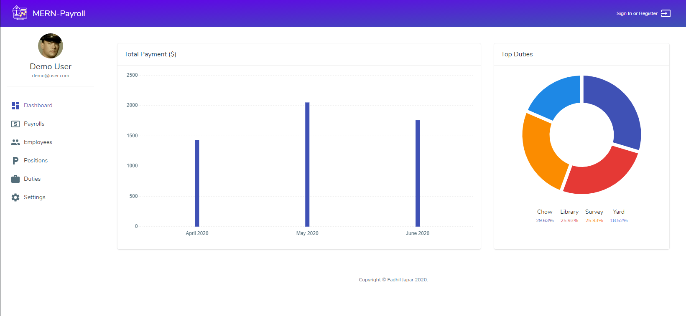
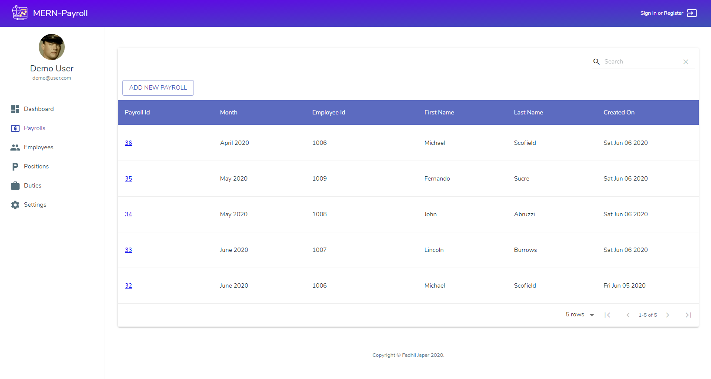

# MERN-Payroll

Mini payroll web app developed using MERN stack.

## Demo

[Live Preview](https://mern-payroll.herokuapp.com)

## Screenshots





## Built With

- [React](https://reactjs.org/) - A JavaScript library for building user interfaces
- [Redux](https://redux.js.org/) - State managment
- [Material UI](https://material-ui.com/) - UI
- [Node](https://nodejs.org/en/) - Used for backend
- [Mongodb](https://www.mongodb.com/) - Database

## Features

- Dashboard UI
- User authentication and authorization
- Form validation
- Create/update employees, durties and rates
- Create/export payrolls to CVS format

## Installing

1. Install dependencies

```
npm i && cd client && npm i && cd ..
```

2. Create keys.js file in `config` folder and replace values with yours

```
dbPassword="Mongodb Connection String"
secretOrKey="secretkey"
```

3. Run project

```
npm run dev
```

## Contribute

Show your support by 🌟 the project.
